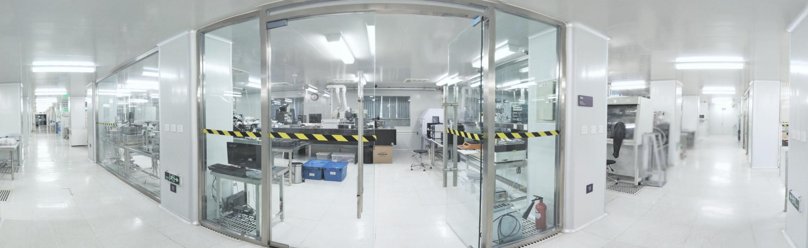

欢迎来到我的个人主页！我是一个充满创意和活力的人，热衷于探索新事物，并乐于分享我的经历和作品。
我来自清华大学机械系,预计26年6月博士毕业。

专利：
[1]"石英晶振传感器."CN116592992A.2023-08-15. （第一完成人）
[2]"真空扫描探针显微镜."CN116660581A.2023-08-29. （第一完成人）
[3]"测量方法、装置、计算机设备和存储介质."CN116678343A.2023-09-01.(第一完成人）
[4]“形貌测量方法及微纳结构测量系统.”CN116697946A.2023-09-05.（学生第一完成人）
[5]"柔性场效应管及其制备方法."CN119521716A.2025-02-25.(第一完成人)
论文：
Junjie Xiong, et al. “Enhanced Electrical Interfaces in Flexible 2D Material Transistors via Liquid Metal and Ionic Liquid Injection.” Advanced Materials (2025): 2501501. (第一完成人)

以下是对个人求职简历的补充：

（一）半导体设备全栈开发

纳米精度[工件台+探头]设备全栈开发。检测晶圆“形貌/电学”缺陷

压电传感器研发。牵引技术：有限元仿真+材料晶体学

压电传感器制作和封装。牵引技术：微纳加工+模拟电路

设备检测精度验证。单原子级别的[运动+检测]精度

（二）器件工艺流片

依托清华大学微纳加工中心自主上机流片

流片过程中典型工艺设备。光刻、薄膜、刻蚀等机台

发表在顶级期刊advaned materila上的场效应晶体管研究,系本团队该领域的第一篇研究工作。

晶体管的典型应用场景。柔性逻辑电路、配合CNN算法用作图像识别

